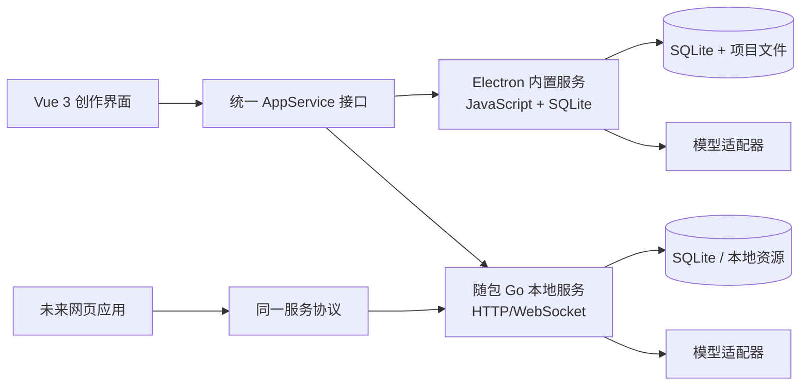

# Novel Studio 项目规划文档

> 文档版本：v0.7 Creative Pack、Codex Agent 与全位置就地创作
> 更新日期：2026-08-25
> 当前状态：桌面骨架、项目与章节管理闭环、正文审阅链路、完整规划与知识中心、Creative Pack、可恢复主控 Agent、ACP 优先/exec 回退的 Codex 网关、全创作位置轻量 AgentRun、逐次审批、当前页候选侧栏、创作质量中心、提示词回归基线、都市悬疑三章基准，以及首版导入导出与项目备份恢复已经完成；真实多模型基准与发布工程仍按后续阶段推进。

> 当前实现：Vue 3 + JavaScript + Vite + Electron 桌面应用已接入 SQLite schema v19、CodeMirror 6 正文编辑器、Monaco 差异确认、Go 服务启动管理、模型配置与任务路由、Creative Pack v1、PromptSnapshot v6、项目备份 v4、可持久化主控 Agent、Codex ACP/exec 双通道、受控项目镜像和逐次审批。项目可保存 `app_model | codex` 默认执行方式；故事基础、人物关系、世界观、总纲、情节弧、章节规划、正文、局部重写、知识连续性、质量评审与修复、提示词和三级文风均可就地启动轻量 AgentRun。所有结果先形成候选；renderer draft 只填入未保存表单，持久化候选在确认后通过 repository 事务写入，Mock 运行只形成流程证据，不产生创作能力达标结论。

## 1. 设计结论

当前设计已经达到启动开发的条件，但还没有把所有实现细节冻结。

已经确定的部分包括：

- 产品定位：面向小说创作者的“小说创作工作台”，降低大纲、章节规划、模型参数和长篇连续写作的使用门槛。
- 产品形态：第一阶段直接做桌面应用，使用 Vue 3 前端；后续复用核心服务和数据协议，扩展网页应用。
- 桌面技术：Electron 负责桌面壳、主进程能力、文件访问、密钥保护和内置服务适配；Vue 3 + JavaScript + Vite 负责界面。
- 本地数据：以 SQLite 作为项目元数据、设定、章节卡、正文版本和任务记录的本地存储。
- Go 服务：作为正式桌面版本随安装包发布的独立本地服务层，由 Electron 负责启动和管理；开发、Mock 和故障回退模式可以由 Electron 主进程直接提供基础能力。
- 模型接入：通过统一模型适配器接入本地模型、DeepSeek、GPT、Kimi 以及其他 OpenAI 兼容接口。
- 模型分工：正文默认优先使用本地模型；大纲、人物、世界观、章节卡、状态提取和局部重写可按任务选择本地模型或外部模型。
- 本地模型管理：由软件或管理员维护连接；同一类型本地模型只保留一个当前生效版本，允许后续替换并保留历史记录。
- 外部模型管理：用户可以自行添加、编辑、测试和启用模型配置。
- 创作方式：用户可以完全手工创作，也可以让模型逐项辅助；AI 生成内容必须可编辑、可接受、可重生成、可保留为备选。
- 文风与自定义提示词：采用项目级、卷级、章节级三级文风作用范围，并提供一次性生成要求。
- 正文编辑：用户可以在编辑面板直接修改正文，支持局部重写和版本回退。
- 数据交换：第一阶段支持 TXT、Markdown、JSON、Word 导入和导出；暂不兼容 NineS-AI 专用数据格式。
- 开源版本：不附带本地模型权重，但保留模型槽位、连接参数和可配置的模型路由能力。

因此，当前设计不是“所有细节已经永远不变”，而是已经形成了一个可以承受模型替换、服务层切换和网页化的稳定产品骨架。

## 2. 产品定位

### 2.1 目标用户

主要用户是希望创作中长篇小说，但不愿意直接面对模型原始参数和复杂提示词的个人作者。

用户可能处于以下状态：

- 只有题材、人物或一个模糊想法，希望逐步发展成完整小说；
- 已经有大纲，希望模型协助拆成卷、章和场景；
- 已经写了部分正文，希望模型帮助续写、改写、检查连续性；
- 有本地模型，希望将其作为主要正文写作模型；
- 没有本地模型，希望先使用 GPT、DeepSeek、Kimi 或其他兼容接口；
- 不想学习温度、Top P、上下文拼接和复杂提示词，但希望保留必要的高级控制能力。

### 2.2 产品核心价值

Novel Studio 不把模型参数作为创作入口，而是把创作意图转化为结构化工作流：

```text
题材与想法
    -> 故事基础
    -> 世界观、人物和关系
    -> 总纲与分卷大纲
    -> 章节卡
    -> 场景计划
    -> 章节正文
    -> 章后状态
    -> 下一章承接
```

用户始终可以在任意节点接管创作、修改内容或跳过 AI。

## 3. 产品边界

### 3.1 第一阶段包含

- 小说项目创建和本地项目管理；
- 题材、受众、篇幅、叙事视角和基础写作目标设置；
- 故事 premise、核心冲突、卖点、世界观、人物和关系管理；
- 总纲、分卷大纲、章节大纲和章节卡；
- 章节正文编辑、自动保存、版本记录和局部重写；
- AI 辅助生成、接受、编辑、重生成和备选内容管理；
- 项目级、卷级、章节级文风与自定义生成要求；
- 任务级模型选择和模型参数预设；
- 本地模型和外部模型的统一连接层；
- TXT、Markdown、JSON、Word 导入和导出；
- 基于章节卡、场景计划、正文和章后状态的连续写作链路；
- Mock 模型模式，方便本地模型尚未完成时开发和测试。

### 3.2 第一阶段不包含

- NineS-AI 专用格式兼容；
- 在线多人协作、账号体系和云端同步；
- 内置模型权重下载、训练和微调管理；
- 自动替用户决定所有故事内容；
- 复杂的出版排版和商业投稿流程；
- 将所有外部模型强制绑定为固定供应商；
- 要求用户额外安装 Go 环境才能运行的桌面基础功能。

## 4. 运行形态设计

### 4.1 三种桌面运行模式

| 模式 | 是否需要 Go | 主要用途 | 能力范围 |
|---|---:|---|---|
| Mock 模式 | 否 | UI 开发、流程演示、自动化测试 | 使用固定样例和模拟流式输出 |
| 桌面内置模式 | 否 | Mock、开发和 Go 服务故障回退 | Electron 主进程提供存储、模型适配、文件和任务能力 |
| Go 服务模式 | 是，随包发布 | 正式桌面版本、本地模型、长任务、知识库和后续网页复用 | Go 提供 HTTP/WebSocket 服务，由 Electron 随应用启动和管理 |

正式桌面安装包内置 Go 服务二进制，用户不需要单独安装 Go。开发、Mock 和故障回退模式可以不启动 Go 进程，由 Electron 主进程提供同等的基础能力。

### 4.2 推荐演进路径



从第一天开始，界面只依赖 `AppService` 能力接口，不直接依赖 Electron API 或 Go API。开发环境先用 Mock 或内置模式，正式安装包默认启动随包 Go 服务；两者对前端保持同一套能力协议。

### 4.3 后续网页应用

网页版本复用以下内容：

- Vue 3 页面和组件；
- 项目数据结构和 JSON Schema；
- 模型适配器的任务抽象；
- 章节卡、场景计划和状态更新流程；
- `AppService` 对应的 HTTP/WebSocket 协议。

网页版本需要另行补充账号、权限、数据隔离、云端数据库、文件存储和 API 密钥托管，不把这些复杂度提前压到第一版桌面应用中。

## 5. 信息架构与主要页面

### 5.1 顶层导航

1. 项目首页：查看最近项目、创作进度、未处理任务和模型状态。
2. 故事基础：题材、卖点、核心冲突、目标读者、世界观和全局写作规则。
3. 人物与关系：人物卡、人物状态、关系图、人物目标和当前知情范围。
4. 结构规划：总纲、分卷、情节弧、章节目录和章节卡。
5. 正文编辑：章节树、正文编辑器、上下文面板、AI 操作和版本历史。
6. 知识与连续性：时间线、地点、设定事实、伏笔、状态快照和检索资料。
7. 模型与任务：模型配置、任务路由、生成记录、失败重试和任务队列。
8. 项目设置：导入导出、备份、快捷键、主题和高级参数。

### 5.2 三栏创作编辑器

正文编辑页采用桌面优先的三栏布局：

```text
┌──────────────┬──────────────────────────────┬────────────────────┐
│ 作品结构栏    │ 正文编辑区                    │ 创作上下文栏        │
│              │                              │                    │
│ 卷 / 章节树   │ 章节标题                      │ 本章目标            │
│ 章节状态      │ 正文内容                      │ 章节卡              │
│ 字数和进度    │ 局部选区                      │ 场景计划            │
│              │                              │ 人物当前状态        │
│              │                              │ 文风与生成要求      │
│              │                              │ 生成 / 重写 / 接受   │
└──────────────┴──────────────────────────────┴────────────────────┘
```

中心区域永远优先服务于正文阅读和编辑；模型控制放在上下文栏和操作抽屉中，避免用户面对参数面板才能写作。

### 5.3 正文编辑器选型

Novel Studio 的正文编辑器采用 CodeMirror 6，整体路线参考 Vela：

- 主编辑器使用 CodeMirror 6，正文以纯文本 / Markdown 字符串作为规范内容；
- Vue 3 中通过 CodeMirror 核心模块封装 `NovelEditor`，不把编辑器实例和业务状态直接混在页面组件中；
- 使用 Markdown 语言扩展、自动换行、搜索替换、撤销重做、中文长文阅读样式和快捷键；
- 编辑器支持选区事件，选中文本后显示“对白有效化、减少解释、内在冲突、节奏压缩”等 AI 重写预设；
- AI 结果先以预览形式出现，用户确认后通过编辑器事务替换选区，并创建正文版本；
- 版本差异使用 Monaco Editor `DiffEditor`，支持并排和内联两种查看方式；
- 三方合并使用单独的合并界面，不把合并逻辑塞进正文编辑器本身；
- Tiptap / Milkdown 暂不作为正文主编辑器，除非以后把复杂富文本节点、批注和嵌入卡片提升为核心需求。

选择 CodeMirror 6 的原因是正文的核心任务是长文本输入、滚动、选区操作、纯文本版本和 Markdown 交换，而不是复杂排版。正文数据以字符串保存，便于 TXT、Markdown、JSON、Word 转换、模型局部重写和跨平台网页复用。

参考 Vela 的实现：主正文使用 CodeMirror 6，版本差异使用 Monaco DiffEditor；相关实现位于 `/Users/weiqifeng/Desktop/code/vela/src/components/editor/CodeMirrorEditor.tsx`、`/Users/weiqifeng/Desktop/code/vela/src/components/editor/MonacoDiffViewer.tsx`。

### 5.4 视觉方向

产品面对的是长时间阅读和写作，不采用高饱和、仪表盘式的 AI 工具视觉。

- 基础色：纸张米白 `#F5F1E8`、墨色 `#1D2024`、边线灰 `#D9D1C4`；
- 强调色：编辑锈红 `#B6553E`，表示需要用户确认的生成内容；
- 辅助色：松绿色 `#345B50`，表示已确认的故事事实和稳定状态；
- 信息色：暖琥珀 `#B9853F`，表示待处理、冲突或需要复核的内容；
- 正文使用适合长篇阅读的中文衬线或高可读性字体；元数据和调试信息使用等宽字体；
- 设计记忆点：右侧上下文栏不是普通设置面板，而是“本章写作镜头”，持续显示模型此刻依据的事实、人物状态、章节目标和文风来源。

这套视觉方向服务于“编辑工作台”而不是“聊天机器人”，后续做网页版本时仍可保留。

## 6. 核心创作工作流

### 6.1 新建项目

用户只需先填写：

- 题材和子题材；
- 一句话想法或已有设定；
- 目标读者和大致篇幅；
- 是否希望 AI 参与规划；
- 默认模型策略：本地优先、外部优先或每一步手动选择。

系统随后可以逐项引导用户生成或填写故事基础，不要求一次性提交完整提示词。

### 6.2 故事规划

故事规划采用“逐项确认”，每个结果都可以：

- 接受为正式内容；
- 先保留为草稿；
- 修改后保存；
- 只重生成当前字段；
- 以当前内容为基础继续扩展；
- 回到手工填写。

推荐流程：

```text
题材 / 想法
  -> 故事 premise
  -> 核心冲突与卖点
  -> 主角和主要人物
  -> 世界观与规则
  -> 总纲
  -> 分卷 / 情节弧
  -> 章节目录
  -> 章节卡
```

### 6.3 章节生产

章节生产对齐当前模型训练规范，采用四步任务链：

1. `card_to_scene_plan`：根据剧情记忆、上一章结尾和本章章节卡生成场景计划。
2. `scene_plan_to_chapter`：根据状态、场景计划和写作要求生成正文。
3. 用户审阅和直接编辑正文。
4. `chapter_to_state_update`：从确认后的正文提取章后状态，供下一章承接。

正文主任务以完整场景为核心，产品层应展示本章目标、场景、阻力、行动、结果、转折、回报、代价和结尾合同，而不是只显示一个“生成正文”按钮。

### 6.4 局部重写

用户在正文中选择一段后，首批内置预设为：

- 对白有效化：删除无效寒暄和信息复述，用目的、回避和筹码交换推进；
- 减少解释式叙述：把抽象判断换成视角人物可感知的现场证据；
- 内在冲突强化：让外在目标、真正顾虑和自我辩护共同影响行动；
- 节奏压缩：删除重复反应与无变化过场，同时保留事实、因果和人物声音。

局部重写必须默认保留原文版本，并显示新旧差异。重写任务不得悄悄改变已确认的人物身份、时间线或剧情事实。

## 7. 文风与提示词体系

### 7.1 作用范围

文风采用三级继承：

1. 项目级：整本小说的总体叙事气质、语言密度、视角和禁用倾向。
2. 卷级：某一卷或情节阶段的节奏、氛围和表达侧重。
3. 章节级：当前章节的临时文风要求，可覆盖部分上级规则。

在此之外，每次生成允许添加“一次性生成要求”，只对当前任务生效，不写入长期文风。

### 7.2 提示词优先级

发生冲突时按以下顺序处理：

```text
已确认事实与人物状态
  > 当前章节卡和场景合同
  > 项目 / 卷 / 章节文风
  > 一次性生成要求
  > 模型默认表达倾向
```

系统内部还要保留任务约束，例如输出格式、长度合同、结尾合同和禁止越界推进。这些约束不要求普通用户直接编辑，但可以在高级设置中查看来源。

### 7.3 文风模板

文风模板不是单一的长提示词，而是结构化字段：

- 叙事视角；
- 句子节奏；
- 对话比例；
- 描写密度；
- 情绪表达；
- 动作和场景偏好；
- 允许的夸张程度；
- 禁止的表达习惯；
- 用户补充的自然语言说明。

这样既可以提供像 NineS-AI 一样的可选文风，也可以让用户添加自定义要求，并避免提示词互相覆盖后无法追踪。

### 7.4 当前编译与管理实现

当前 schema v16 已把任务提示词从模型适配器拆入统一 `PromptCompiler`，并完成创作提示词候选库接入：

- 八类内置任务模板以模板版本和全局绑定保存，内置模板只负责任务协议，不与供应商请求代码混合；
- 已确认事实优先级和可解析输出协议由编译器固定追加，自定义模板不能删除这两层保护；
- 章节规划可以明确选择所属分卷；生成时按项目级、当前卷级、当前章节级顺序装配文风；
- 项目级或卷级规划任务只读取与目标作用域匹配的文风，不会误用第一章的章节要求；
- Electron 内置网关与 Go 网关接收同一份已编译 `messages`，Go 不重复拼接提示词；
- 每次生成在请求前保存模板版本、文风来源、完整 messages、提示词哈希和上下文诊断，结束后补充模型参数、输出或错误状态。
- 内置模板只读，自定义模板每次修改保存为不可变新版本，并可绑定到项目、分卷或章节范围；
- 结构化文风编辑器覆盖视角、距离、句子节奏、对白、描写、情绪、推进速度、感官和禁用表达，同时保留自由描述；
- 32 个合并后的内置提示词插件与自定义插件可以按任务和范围启停；升级时旧同义插件绑定会迁移到新 ID，不丢失用户选择；
- 章节卡、场景计划和正文内置模板升级为 v3，场景计划使用固定 JSON 结构；旧版自由文本保存在 `legacyNotes`；
- 局部重写使用对白有效化、减少解释式叙述、内在冲突强化和节奏压缩四个预设；模板、专项 `promptProfile`、叠加要求、三级文风与上下文诊断进入 schema 4 生成快照；
- “最终编译预览”展示模板、三级文风、插件与保护层来源，并直接呈现模型将收到的 system / user 消息、字符数和哈希。
- 章后状态提取和连续性审计采用受保护 JSON 协议；结果先写入持久化候选，状态快照接受后进入后续章节上下文，并拆成可编辑、可逐条接受或丢弃的事实、时间线和伏笔候选；审计接受后才拆成可逐条处理的 AI 检查。

## 8. 模型与任务路由

### 8.1 模型抽象

界面和创作流程只认识以下概念：

- 模型提供方 `Provider`；
- 模型配置 `ModelProfile`；
- 创作任务 `TaskType`；
- 任务路由 `TaskRoute`；
- 生成请求 `GenerationRequest`；
- 生成结果 `GenerationResult`。

推荐任务类型：

| 任务 | 默认建议 | 是否允许用户切换 |
|---|---|---:|
| 故事想法扩展 | 外部或本地规划模型 | 是 |
| 人物与世界观 | 外部或本地规划模型 | 是 |
| 总纲与分卷规划 | 外部或本地规划模型 | 是 |
| 章节卡 | 外部或本地规划模型 | 是 |
| 场景计划 | 本地模型或规划模型 | 是 |
| 正文写作 | 本地模型优先 | 是 |
| 局部重写 | 本地模型或外部模型 | 是 |
| 章后状态提取 | 本地模型或低成本外部模型 | 是 |
| 连续性检查 | 本地或外部模型 | 是 |

模型适配器需要区分两类协议：

- `chat_completions`：发送 `messages` 到 `/chat/completions`，用于 DeepSeek、Kimi、本地 OpenAI 兼容接口和大多数自定义接入；
- `responses`：发送 `input`、`instructions` 和 `reasoning` 配置到 `/responses`，用于 OpenAI 官方模型的高级能力。

两类协议在内部统一转换成 `GenerationResult`，前端不感知供应商的请求格式差异。

### 8.2 本地模型

- 本地模型连接由软件或管理员维护；
- 软件内部只保留一个当前生效的同类型本地模型；
- 允许管理员替换 endpoint、模型标识、上下文长度和默认生成参数；
- 模型替换不修改历史章节和历史生成记录；
- 如果本地模型提供 OpenAI 兼容接口，第一版直接通过通用适配器接入；
- 如果未来需要特殊协议，只新增适配器，不改创作工作流。

### 8.3 外部模型

用户可以添加：

- OpenAI 兼容接口；
- DeepSeek；
- GPT；
- Kimi；
- 其他具备标准聊天或流式生成接口的服务。

API Key 只由 Electron 主进程或 Go 服务访问，Vue 渲染进程不直接持有明文密钥。配置中应记录提供方、模型名、endpoint、上下文能力、默认参数和是否允许用于正文。

### 8.3.1 首版官方预设

以下是基于 2026-08-17 官方文档整理的首版预设。表中的“软件默认”是 Novel Studio 为小说规划任务设置的起始值；供应商未明确支持或固定的参数不主动发送。

| 提供方 | Base URL | 默认模型 | 协议 | 软件默认 | 关键兼容规则 |
|---|---|---|---|---|---|
| DeepSeek | `https://api.deepseek.com` | `deepseek-v4-flash` | Chat Completions | `stream: true`、thinking 开启、`reasoning_effort: high`、结构化任务使用 `json_object` | `temperature` / `top_p` 二选一；`deepseek-v4-pro` 作为高质量备选 |
| GPT | `https://api.openai.com/v1` | `gpt-5.4` | Responses 优先；兼容 Chat Completions | `stream: true`、`reasoning.effort: medium`、规划任务 `max_output_tokens: 8192` | GPT-5.4 支持 Responses 和 Chat Completions；官方模型快照可作为可复现配置 |
| Kimi | `https://api.moonshot.cn/v1` | `kimi-k3` | Chat Completions | `stream: true`、`reasoning_effort: max`、规划任务 `max_tokens: 8192` | K3 固定 `temperature: 1.0`、`top_p: 0.95`、`n: 1`，软件不显式发送这些字段 |

具体说明：

- DeepSeek 当前官方 API 提供 `deepseek-v4-flash` 和 `deepseek-v4-pro`，thinking 默认开启；常规请求的推理强度默认为 `high`。Novel Studio 默认使用 Flash，复杂总纲、连续性审查和高质量结构化规划可切换 Pro。
- GPT 首版使用 `gpt-5.4` 作为稳定预设，而不是把 ChatGPT 专用模型名写入配置。官方页面显示 GPT-5.4 支持 1M 上下文、128K 最大输出，并同时支持 Chat Completions 和 Responses；软件默认只在任务级设置输出上限，不把 128K 当作一次正文生成目标。
- Kimi 当前官方快速开始推荐 `kimi-k3`，其 API 兼容 OpenAI 格式，支持 1M 上下文；K3 始终保留推理，通过顶层 `reasoning_effort` 控制强度。
- 供应商的模型别名、上下文长度和可用参数会变化，模型配置必须允许用户刷新模型列表或手动修改模型 ID。

官方资料：

- [DeepSeek Chat Completions API](https://api-docs.deepseek.com/api/create-chat-completion/)
- [DeepSeek Thinking Mode](https://api-docs.deepseek.com/guides/thinking_mode/)
- [OpenAI GPT-5.4 Model](https://developers.openai.com/api/docs/models/gpt-5.4)
- [Kimi 快速开始](https://platform.kimi.com/docs/overview)
- [Kimi 模型参数参考](https://platform.kimi.com/docs/api/models-overview)

### 8.3.2 自定义 OpenAI 兼容接入

用户可以在“添加模型”中自定义 OpenAI Chat Completions 兼容接口。基础表单管理显示名称、Base URL、模型 ID 和加密保存的 API Key；“JSON 请求配置”管理供应商差异：

- 显示名称和提供方名称；
- `base_url`，例如 `https://example.com/v1`；
- API 路径模式：默认 `/chat/completions`，可通过 `endpointPath` 自定义；
- 额外请求头，并使用 `{{apiKey}}` 引用安全存储的 API Key；
- 模型 ID；
- 当前协议类型为 Chat Completions；Responses 或其他协议通过独立 Provider 适配器扩展；
- 是否支持流式输出、JSON 输出、工具调用和 reasoning 参数；
- 上下文长度、最大输出长度、超时、重试和代理设置；
- 任意供应商请求参数，以及按创作任务覆盖的参数。

配置示例：

```json
{
  "endpointPath": "/chat/completions?api-version=2026-01-01",
  "stream": true,
  "headers": {
    "X-Provider-Version": "2026-01",
    "api-key": "{{apiKey}}"
  },
  "body": {
    "min_p": 0.08,
    "repetition_penalty": 1.05
  },
  "taskBody": {
    "chapter": {
      "max_tokens": 12000
    },
    "chapter_card": {
      "response_format": {
        "type": "json_object"
      }
    }
  }
}
```

参数按“软件任务默认值 → `body` → 当前任务 `taskBody`”合并。可覆盖任务默认采样与输出参数，但 `model`、`messages`、`stream` 由软件管理，不能藏在 body 中覆盖。API Key 不写入 JSON；Authorization、api-key 等敏感请求头必须引用 `{{apiKey}}`。当前自定义模式仍要求响应使用 OpenAI 兼容的 `choices[].message.content` 或 SSE `choices[].delta.content` 结构，完全不同的请求/响应协议应新增 Provider 适配器。

保存前可执行“测试连接”，分别检查模型列表、普通文本、流式输出和结构化 JSON 四项能力，并把结果与探测时间记录在 `ModelProfile.capabilities` 中。当前探测结果用于设置页状态展示和故障诊断；后续参数协商可据此自动收敛请求字段。

### 8.4 参数策略

普通用户看到的是“创作策略”和少量可理解的选项：

- 更稳定；
- 更有变化；
- 更严格遵循章节卡；
- 更重视文风；
- 生成长度。

高级用户可以展开温度、Top P、重复惩罚、最大输出长度、随机种子、推理强度和超时。对于供应商固定或不支持的参数，界面显示为只读说明，不提供无效输入。每次任务保存实际使用的参数快照，避免后续无法复现结果。

## 9. 数据结构与版本策略

### 9.1 核心实体

- `Project`：项目和书籍基本信息；
- `StoryFoundation`：题材、卖点、核心冲突、目标读者和全局规则；
- `Volume`：分卷或故事阶段；
- `Arc`：情节弧；
- `Chapter`：章节目录、状态和正文关联；
- `ChapterCard`：本章目标、场景、转折、回报、代价和结尾合同；
- `ScenePlan`：可执行的场景计划；
- `Manuscript`：正文内容和当前版本；
- `Character`：人物卡、当前状态、目标、关系和知情范围；
- `WorldFact`：世界观事实和约束；
- `TimelineEvent`：时间线事件；
- `StateSnapshot`：章后状态快照；
- `KnowledgeItemCandidate`：从已接受状态快照拆出的待确认事实、时间线或伏笔；
- `StyleProfile`：项目级、卷级和章节级文风；
- `ModelProfile`：模型连接与参数配置；
- `TaskRoute`：任务到模型的映射；
- `ContextProfile`：项目级上下文预算、最近章节数、相关旧章数和知识上限；
- `ChapterMemory`：由章节合同、场景计划和正文首尾生成的可重建章节记忆；
- `GenerationTask`：一次生成任务及其状态；
- `Revision`：正文或结构内容的版本；
- `ExportJob`：导入导出任务记录。

schema v8 建立 `prompt_templates`、`prompt_template_versions`、`prompt_bindings`、`style_profiles` 和 `generation_records`；schema v9 增加提示词插件；schema v10 接入首批创作模板；schema v11–v12 建立知识候选和逐条签批；schema v13–v14 增加人物关系与跨卷情节弧；schema v15 保存模型能力探测、请求快照和重试谱系；schema v16 增加结构化场景计划、生成意图与父生成记录、质量报告、人工评分、隐藏基准工作区和基准步骤。生成记录保留完整提示词快照，不依赖模板或插件后续是否升级，旧结果始终可追溯。

### 9.2 AI 内容来源标记

每个可编辑内容都应记录来源：

- `user-authored`：用户手工创建；
- `ai-generated`：模型生成；
- `user-edited`：用户基于 AI 结果修改；
- `confirmed`：用户确认作为当前正式内容；
- `archived`：历史或被替换内容。

这个标记用于版本历史、差异查看、重生成提示和后续数据分析，不用于限制用户编辑。

### 9.3 生成记录

每次生成至少保存：

- 任务类型；
- 输入内容快照或输入哈希；
- 使用的模型配置版本；
- 使用的提示词模板版本；
- 三级文风合并结果；
- 实际生成参数；
- 输出内容；
- 用时、token 使用量和错误信息；
- 用户是否接受、修改或丢弃。

当前实现还会保存经过白名单裁剪、明确不含 API Key 的任务快照、自动重试事件和 `retry_of_id` 谱系。网络超时、限流和临时服务错误只在尚未收到任何正文增量时最多自动尝试三次；一旦流式内容已经开始到达，任务立即停止自动重试，避免不同响应被拼接。历史记录中的“再次生成”会基于原任务参数和当前已确认上下文创建新候选，不直接覆盖正文或规划。

这是应对本地模型后期替换的关键设计：模型变化只影响新任务，不破坏旧结果的可追溯性。

### 9.4 长篇上下文与章节记忆

长篇小说不把全书正文直接塞进单次请求。schema v7 为每个项目保存上下文配置，并为每章维护可重建的本地记忆。每次生成按以下优先级装配：

1. 当前项目、当前章节卡、场景计划、正文尾部和一次性要求；
2. 当前章之前固定数量的最近章节；
3. 根据标题、章节合同、场景和正文记忆召回的相关旧章；
4. 与本次任务相关的事实、时间线、伏笔和连续性记录。

所有片段受单次字符预算约束。生成结果携带实际使用字符数、最近章节 ID、相关旧章 ID、知识记录 ID 和是否截断，便于后续生成记录与问题诊断。章节变化后只重建对应记忆；用户也可以在“知识与连续性—长篇上下文”中调整预算并手动重建全部章节记忆。

## 10. 存储与项目文件

第一版采用“SQLite 为主、附件目录为辅”的本地项目结构：

```text
novel-project/
├── project.json              # 项目标识、格式版本和基本信息
├── novel-studio.sqlite       # 结构化数据、正文版本、任务和生成记录
├── attachments/              # 参考资料、图片和用户附件
├── exports/                  # 导出的 TXT、Markdown、JSON、Word 文件
└── backups/                  # 自动备份和手动备份
```

数据库格式必须带 `schema_version`。项目升级采用迁移脚本，禁止因为增加字段就让旧项目无法打开。

### 10.1 导入

- TXT：按文件或章节目录导入，支持用户确认章节切分；
- Markdown：保留标题层级和基础段落结构；
- JSON：支持 Novel Studio 自有 JSON Schema；
- Word：导入段落、标题和基础章节结构，复杂排版只作为普通内容处理。

首版导入根据标题和章节标题自动切分，并始终建立独立新项目，不直接覆盖当前项目。章节切分预览与手工映射作为后续增强项。

### 10.2 导出

- TXT：适合纯正文备份；
- Markdown：保留章节标题和目录；
- JSON：保留项目结构、设定、章节卡、正文版本和来源信息；
- Word：面向阅读和交付，提供基础标题、段落和章节分页。

当前实现中，TXT、Markdown 和 Word 用于正文交换；JSON 用于完整项目备份。项目备份包含正文、版本、规划、知识与连续性、上下文、项目提示词绑定、自定义提示词、生成记录、质量报告和人工评分，不包含模型档案、任务路由、API Key 或内置基准工作区。恢复时校验格式版本与 SHA-256 摘要，并创建带新 ID 的“恢复副本”，原项目保持不变。

## 11. 服务层边界

### 11.1 AppService 能力

前端只通过统一能力接口调用：

- 项目和章节 CRUD；
- 结构化设定管理；
- 生成任务提交、流式事件和取消；
- 模型配置读取、保存和测试；
- 版本创建、差异比较和恢复；
- 导入导出；
- 连续性检查和状态更新；
- 备份与恢复；
- 日志和错误查询。

### 11.2 Electron 内置实现

第一版由 Electron 主进程实现：

- SQLite 读写；
- 文件和目录访问；
- 外部模型 HTTP 请求；
- 本地模型 HTTP 请求；
- 流式响应转发；
- 密钥安全存储；
- 导入导出和后台任务。

Vue 渲染进程通过受控 IPC 调用，不直接访问 Node 文件系统和 API Key。

### 11.3 Go 实现

Go 服务作为正式桌面版本随包发布的本地服务层，优先承担：

- 本地模型进程管理；
- 长时间生成任务和队列；
- 知识库索引与检索；
- 资源占用监控；
- 未来网页应用的 API 服务；
- 多平台后台服务和独立升级；
- 为未来网页版本提供同一套 HTTP/WebSocket API。

Go 服务应尽量使用稳定的 JSON/HTTP 和 WebSocket 协议。桌面安装包使用 Electron Builder 的额外资源机制携带 Go 二进制，推荐目录约定为：

```text
resources/
└── novel-studio-service/
    ├── darwin-arm64/novel-studio-service
    ├── darwin-x64/novel-studio-service
    ├── win32-x64/novel-studio-service.exe
    └── linux-x64/novel-studio-service
```

Electron 主进程负责：

1. 根据当前平台选择随包二进制；
2. 生成临时端口和服务数据目录；
3. 通过 `child_process.spawn` 启动 Go 服务；
4. 等待 `/health` 返回成功后再让 Vue 页面进入可用状态；
5. 将服务地址注入 `AppService`，并转发流式任务事件；
6. 退出应用时优雅停止服务，异常时记录日志并尝试重启；
7. 开发环境允许使用本地 `go run`、MockProvider 或 Electron 内置模式。

Go 服务本身不直接管理 API Key 的 UI 展示；密钥通过受控 IPC 或本地安全存储交给服务使用，日志中必须脱敏。

## 12. 安全与隐私设计

- API Key 不进入 Vue 页面状态、localStorage 或导出的普通项目 JSON；
- 外部模型发送前显示目标模型和数据范围；
- 用户可以配置“正文允许使用的模型”和“仅允许本地模型的内容”；
- 默认不上传整个项目，只发送当前任务所需上下文；
- 生成日志记录请求范围，但对密钥和敏感配置脱敏；
- 本地项目支持手动备份和自动备份；
- 开源版默认使用 Mock 模式或用户自定义接口，不捆绑本地模型权重。

## 13. 模型未完成时的开发策略

本地模型尚未训练完成不阻塞软件开发。开发阶段采用三层替代：

1. `MockProvider`：返回可预测的结构化结果，验证界面和工作流。
2. `OpenAICompatibleProvider`：连接任意兼容接口，验证真实流式输出、错误和超时。
3. `LocalProvider`：本地模型最终确定后只补充连接参数或专用协议适配。

所有任务必须通过同一套请求结构，不把某个本地模型的特殊 prompt 或参数散落在页面组件中。

训练规范中的三类任务名称直接作为产品任务协议的一部分：

- `card_to_scene_plan`；
- `scene_plan_to_chapter`；
- `chapter_to_state_update`。

如果后续模型任务发生变化，增加任务版本或新的适配器，不直接破坏旧项目。

## 14. 开发阶段规划

### 阶段 0：设计基线（已完成）

- 形成产品定位、运行形态和数据边界；
- 确认 Vue 3、Electron、SQLite 和 Go 随包发布路线；
- 固定 `AppService`、任务类型和模型适配器抽象；
- 输出本规划文档。

### 阶段 1：桌面骨架与 Mock 工作流（核心已完成）

- 创建 Vue 3 + JavaScript + Vite + Electron 工程；
- 实现项目、卷、章节和基础设定数据结构；
- 实现三栏编辑器壳；
- 实现 MockProvider 和生成任务状态；
- 实现自动保存和基础版本记录。

验收重点：不用真实模型也能完整走通“创建项目—规划—生成—编辑—保存—导出”。

### 阶段 2：小说规划工作台（核心已完成）

- 故事基础表单；
- 人物卡、关系字段、世界观总览和世界设定卡；
- 总纲、分卷阶段和章节规划；
- AI 逐项生成与确认；
- 文风三级继承和一次性生成要求。

阶段 2 已完成。人物关系图使用人物卡作为节点并支持结构化关系编辑；地点视图使用地点类世界设定卡作为稳定来源，并叠加已接受章后状态中的人物最新位置；跨卷情节弧以“情节线 × 分卷”矩阵呈现，每个关键变化节点可关联具体章节。规划数据与连续性数据继续共用正式来源。

### 阶段 3：正文编辑与连续写作（核心已完成）

- 章节树和正文编辑器；
- 章节卡到场景计划；
- 场景计划到正文；
- 章后状态更新；
- 局部重写、差异查看和版本回退；
- 知识事实、时间线、伏笔账本和连续性检查；
- 连续性提醒的忽略、处理和重新打开；
- 章节卡和场景计划统一进入 Monaco 候选差异确认；
- 章节记忆、相关旧章召回和项目级上下文预算。

### 阶段 4：模型配置与外部模型（核心已完成）

- ModelProfile 管理；
- OpenAI 兼容接口；
- DeepSeek、GPT、Kimi 的预设或兼容配置；
- 任务级模型路由；
- 流式输出、取消、重试和错误诊断；
- API Key 安全存储。

当前已完成模型档案、任务路由、OpenAI 兼容流式请求、Go/内置双网关、取消、四项供应商能力探测、DeepSeek 高级参数透传、无输出阶段的指数退避自动重试、生成凭证浏览和人工重试候选链路。局部重写因为依赖即时选区，只在编辑器中重新发起，不从历史记录直接重放。

### 阶段 5：本地模型与 Go 服务

- 接入最终本地模型；
- 增加本地模型健康检查和资源状态；
- 将长任务、知识库和本地模型管理放入随包 Go 服务；
- 完成 Electron 对 Go 子进程的启动、健康检查、重启和优雅退出；
- 生成 macOS、Windows、Linux 对应的 Go 服务二进制并纳入桌面安装包；
- 保持 Electron 内置模式可作为开发和故障回退。

### 阶段 6：发布与网页版本评估

- macOS / Windows / Linux 打包策略；
- 项目格式迁移和备份恢复；
- 网页端 API、账号和云端存储方案评估；
- 复用 Vue 页面和服务协议开发网页版本。

## 15. 质量验证

### 15.1 软件层测试

- 数据库迁移和旧项目打开测试；
- 项目、章节、版本和导入导出测试；
- Mock 任务状态机测试；
- 流式输出、取消、重试和超时测试；
- Provider 适配器合同测试；
- API Key 不出现在渲染进程和日志中；
- Electron 内置模式与 Go 服务模式的接口一致性测试。

### 15.2 创作层测试

- 章节卡是否能稳定生成场景计划；
- 场景计划是否按顺序执行；
- 正文是否承接上一章状态和结尾；
- 是否出现事实冲突和越界推进；
- 结尾是否停在具体动作、信息、决定或后果上；
- 用户修改后的正文是否优先于旧 AI 结果；
- 局部重写是否保留确认事实。

当前质量中心将上述检查落实为两套可执行证据：

- 10 项提示词回归基线逐项真实生成，并由评审模型按固定断言给出 0–2 分；所有关键断言必须为 2，平均分不得低于 1.6；
- 都市悬疑三章基准从专项故事字段开始，连续生成章节卡、结构化场景卡、正文、七维质量报告和章后状态；真实模型七维平均分不低于 3.8、单项不低于 3.0且无高严重度未解决问题后，仍需至少一份人工盲评才能给出最终通过；
- 两套基准均保存完整输入、输出、提示词快照、模型参数、重试、耗时与分数，支持暂停、继续、取消和恢复查看；Mock 始终标记为模拟运行。

### 15.3 模型替换测试

更换本地模型或外部模型后，至少验证：

- 旧项目能正常打开；
- 旧生成记录仍可查看；
- 新模型可以继续使用旧章节卡和旧状态；
- 任务参数和 prompt 版本可追溯；
- 失败时可以切换到其他 Provider 或 MockProvider。

## 16. 当前待确认项

这些内容不阻塞第一阶段开发，但在对应阶段开始前需要锁定：

### P0：进入正式实现前确定

- Electron 具体版本和打包方案；
- SQLite 驱动以及 CodeMirror 6 / Monaco DiffEditor 的依赖封装；
- 首版支持的操作系统范围；
- 自有 JSON Schema 的首个正式版本；
- Go 服务的随包目录和开发环境启动脚本。

### P1：接入真实模型前确定

- 本地模型最终 endpoint 和协议；
- 本地模型默认上下文长度与最大输出长度；
- 哪些任务默认禁止发送到外部模型；
- 生成任务的正式并发上限；当前单任务超时与无输出重试策略已落地，后续按最终本地模型压测调整数值。

### P2：发布和网页阶段确定

- Go 服务与 Electron 的启动、升级和端口发现方式；
- Go 服务版本与桌面应用版本的兼容矩阵；
- 网页版是否需要账号、云同步和多人协作；
- 云端 API Key 的托管方式；
- 开源版本的许可证、默认配置和社区扩展机制。

## 17. 开发入口约定

后续实现应遵守以下边界：

- Vue 页面不直接调用模型、不直接读写文件、不保存 API Key；
- 所有模型调用必须经过 Provider 和 TaskRoute；
- 所有 AI 结果都必须进入版本和来源记录；
- 所有正文生成都必须带有明确的章节卡、场景计划或等价任务合同；
- 所有项目数据都必须带 schema 版本；
- 不把最终本地模型的名称、特殊参数或专用 prompt 写死在业务组件中；
- 先完成 Mock 工作流，再接真实模型；
- Go 服务是正式桌面版本的随包服务实现；开发和故障回退模式仍保留 Electron 内置服务。

## 18. 当前结论

Novel Studio 的产品设计和总体技术设计已经完成，桌面工程已经进入可持续迭代状态。当前已形成以下闭环：

- 多项目的新建、编辑、归档、恢复和删除；
- 章节的新建、复制、排序、删除和版本恢复；
- 正文自动保存、关闭前保存、AI 候选稿和局部重写确认；
- 故事基础、人物、世界观、总纲、分卷和章节规划的手工编辑与 AI 候选签批；
- SQLite migration、外键级联、Go 流式网关、任务取消和内置回退；
- 知识事实、章节时间线、伏笔账本、可解释连续性检查，以及提醒处理和重新打开；
- 模型连接测试、DeepSeek 思考/推理/采样/输出参数，以及 Go 服务安全参数透传；
- 可校验、可持久化的 JSON 模型请求配置，以及自定义路径、请求头、流式模式和按任务参数覆盖；
- 章节卡、场景计划和正文统一候选确认，AI 结果不会直接覆盖正式内容；
- schema v7 长篇上下文配置、章节记忆、最近章节与相关旧章召回、知识选择和预算诊断。
- schema v8 版本化任务提示词、三级文风继承、章节归卷与生成快照。
- schema v9 提示词与文风管理中心、自定义模板版本、结构化文风、范围插件和最终编译预览。
- schema v10 因果章节卡、状态连续场景计划、受控章节正文、四类局部重写预设和七个新增写作插件。
- schema v11 持久化知识候选、章后状态快照、AI 连续性审计与确认后上下文注入。
- schema v12 状态快照拆分知识候选、逐条编辑/接受/丢弃，以及作者确认后的 AI 来源知识。
- schema v13 结构化人物关系、关系趋势图，以及地点设定与最新人物状态聚合视图。
- schema v14 可编辑跨卷情节线、关键变化节点，以及分卷和章节双重关联。
- schema v15 模型能力探测结果、无密钥任务快照、自动重试执行轨迹、重试谱系和生成记录浏览。
- schema v16 结构化场景计划、正文四种生成意图、质量报告、人工盲评、提示词回归与三章创作基准。
- schema v17 Creative Pack 版本锁定、主控 AgentRun、步骤依赖、候选和桥接审批。
- schema v18 Codex ACP 会话、事件、执行后端、受控审批和 exec 回退血缘。
- schema v19 项目默认创作执行方式，以及全创作位置轻量 Codex AgentRun。
- TXT、Markdown、Word 正文导入导出，以及 JSON 项目备份、完整性校验、ID 重映射和非覆盖恢复。

下一步按依赖关系实现：

1. 导入章节切分预览、冲突映射与自动备份策略；
2. 本地模型最终协议、健康检查、资源状态与并发队列；
3. CI、跨平台安装包、签名与开源文档；
4. 网页端服务协议与部署方案评估。

这样即使本地模型后续更换，软件的产品流程、数据结构和用户界面也无需推倒重来。
